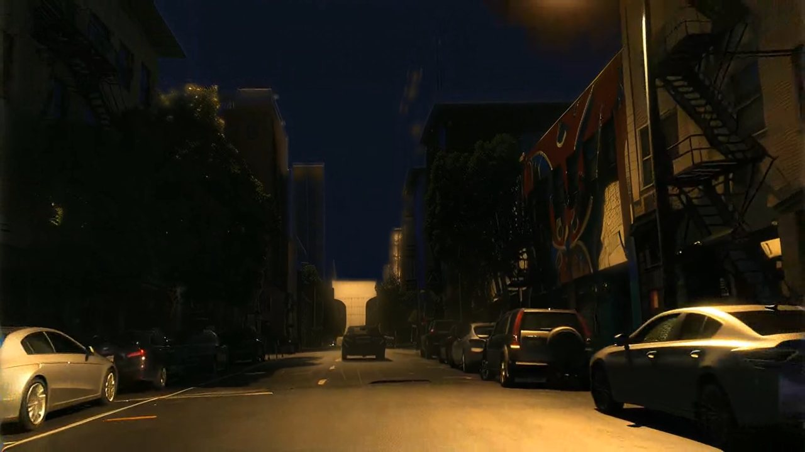

# Reactor / Orbis spike findings

Person 2, Phase 1. Every number here was measured against the live Reactor API
on 2026-09-12, not read off the docs. The harness is `frontend/app/spike/`,
driven headless. Curated frames are in `docs/spike/evidence/`; the raw timing
logs are in `docs/spike/runs/*/report.txt` (the full-size PNG dumps are ~40MB
and gitignored).

**Headline: the product premise works, but only with one extra step that is not
in PLAN.md — the seed image must be converted to night before it reaches Orbis.**
A daytime Street View frame produces a daytime video no matter what the prompt
says. The conversion is offline numpy/Pillow — no new API, no new key.

---

## Answers

| # | Question | Answer |
|---|---|---|
| Q1 | Does Orbis condition on a Street View seed via `set_image`? | **YES, strongly — but the seed must be night-graded first.** Raw daytime seed → daytime video, prompt ignored. |
| Q2 | WebRTC live session or REST submit/poll? | **WebRTC live session.** There is no REST inference lane. |
| Q3 | Concurrent sessions? | **1 per model.** Account quota, and it overrides the token's `max_sessions`. |
| Q4 | Session init latency? | **~12–16s** cold to first picture (dynamic). Re-seeding inside a live session: **~2.3s**. |
| Q5 | `-stable` or `-dynamic`? | **`-dynamic`.** Far more consistent time-to-first-frame, plus mid-run prompt morphing. |

---

## Q1 — image conditioning (critical)

### Conditioning itself is excellent

Seeded with a real Mapillary frame of a Golden Gate Ave block, Orbis does not
merely "start from" the image — it *continues* it. The mural, the blue
storefront, the tree line, the SUV with the spare-tyre cover and the street
geometry all persist, and the camera walks forward down that street.

This is exactly what the product needs. It is a much stronger result than
"accepts a start image".

### But the seed's lighting beats the prompt

With a **daytime** seed and an explicit night prompt
(`"...street at night, amber sodium streetlights, wet asphalt..."`), the output
is **full daylight — blue sky, hard sun shadows** — and stays that way for the
whole run. The prompt's lighting terms lose to the image.


`evidence/02` — blue sky, midday, from an explicit night prompt. `evidence/03`
shows it is still midday 25s in.

This directly threatens non-negotiable rule #1. The rule was written about
*flashing* a daytime JPEG; the real failure mode is worse — Orbis will happily
**generate sustained daytime video** of the right block.

For contrast, with **no seed at all** the same night prompt gives a convincing
night street (`evidence/01`) — it is just a
generic one, not that block. So the two halves of the premise were in direct
tension until the fix below.

### The fix: night-grade the seed before `set_image`

Converting the seed to night offline, then seeding with *that*, gives night
video **and** the real block:

`docs/spike/seeds/golden-gate-ave-west.jpg` → `...-night.jpg` is the grade, and
seeding with it gives:



`evidence/04` — night, same mural, same tree line, same parked SUV.

Reference implementation: `docs/spike/nightgrade.py` (numpy + Pillow, offline,
milliseconds, no API key). It replaces the sky, applies a sodium-vapour cast,
keeps highlights as light sources, and adds a wet-road sheen. Geometry is
untouched, which is the whole point.

**Two tuning facts, both learned the hard way:**

1. **Exposure decides whether the block survives.** A graded seed at mean luma
   **0.043 lost the block** (`evidence/06`); the same frame regraded
   to **0.061 reproduced it** — hotel sign, laundromat sign, fire escapes,
   downhill view (`evidence/07`). Target ~0.06; too dark
   and there is no structure left to condition on.
2. **The sky mask must handle overcast.** A blue-dominance test alone misses
   SF's grey skies and leaves a bright cloud mass that hijacks the render.
   Detect "bright and desaturated" as well.

`nightgrade.py` is a levels-and-colour grade, not a relight, and it needs its
exposure watched (below). That is its only real weakness, and it is cheap to
manage. **No image-generation API is needed for this** — it is numpy and
Pillow, offline, no key. The starter's leftover Nano Banana route
(`frontend/app/api/nano-banana/`) is not part of our pipeline and we are not
building on it, per the plan's own note on the starter.

### Fidelity decays with time-in-block

Conditioning is strong for roughly the first ~10s and has drifted off the real
geometry by ~25s (`evidence/05` is still night, but is no
longer that block; `evidence/08` likewise).

This *validates* the plan's block-level session design and puts a number on it:
**a block should hold the screen for ~8–15s, not longer.** Past that we are
showing an invented street, which breaks the "familiarisation tool" promise.

---

## Q2 — lane

**WebRTC live session only.** `@reactor-team/js-sdk` is browser-only (wasm +
`RTCPeerConnection`); the model page states no REST inference lane exists.
`requestClip()` / `requestRecording()` return recordings of a live session —
they are not a submit/poll API. So we hold sessions, we do not queue jobs.

Commands confirmed live: `set_image`, `set_prompt`, `set_audio_prompt`,
`set_seed`, `set_resolution`, `start`, `pause`, `resume`, `reset`.

---

## Q3 — concurrency: **1**

```
429 {"error":"quota_exceeded","limit":1,"current":1,
     "quota_type":"concurrent_sessions_per_model",
     "model":"reactor/visko-orbis-dynamic"}
```

Minting a token with `max_sessions: 3` is **accepted**, and then the second
`connect()` is refused anyway — the account quota is the real limit, not the
token's scope. Session 1 ready, sessions 2 and 3 refused
(`docs/spike/runs/q3-concurrency/report.txt`).

The quota is **per model**, so one `-stable` plus one `-dynamic` session is
possible — not useful for compare mode, which needs two sessions of the same
model.

Reactor's public docs advertise 5 concurrent per account; this key gets 1.
**Reactor staff were clear this will not be raised, so it is a fixed
constraint, not a temporary one.** It is the single limit doing the most damage
to the plan, and the architecture has to absorb it rather than wait it out.

### Consequences for PLAN.md

- **Phase 4 prefetch is dead, permanently.** The plan already says "if Q3 said
  1, skip this task". It said 1, and the quota is not moving.
- **Phase 3 compare mode cannot run two live viewports.** Route B must be
  pre-generated, or the two routes run sequentially and get stitched.
- **Autoplay cannot warm block N+1 while block N plays** — which is what Q6
  below is about.

### Operational trap

There is **no REST endpoint to list or kill sessions** (`/sessions`,
`/v1/sessions`, `/api/sessions` all 404 with the API key). A crashed client
leaves its session holding the only slot, and every subsequent connect gets 429
until it ages out. This bit us three times during the spike.

Two rules follow, and both matter on demo day:

1. **Always `disconnect()` in a `finally`.** A tab closed mid-session blocks the
   next run.
2. **Mint the JWT once per session and pass the string.** Passing a *resolver*
   that mints a fresh token per call — which is the natural reading of the SDK's
   `jwt: () => fetchToken()` — makes the second HTTP call arrive with a token
   that does not own the session the first one created:

```
403 this token is session-scoped and is not authorized for this resource
```

The starter avoids this by caching the promise (`jwtPromise.current ??= ...`).
The session manager must keep doing that.

---

## Q4 — latency budget

Measured on `-dynamic`, medians across runs in `docs/spike/runs/`:

| Step | Time |
|---|---|
| `POST /api/token` | ~0.4–0.8s |
| `connect()` → status `ready` | ~7–11s |
| fetch seed + `uploadFile` + `set_image` → `state.has_image` | ~1.5–2.5s |
| `set_prompt` → `conditions_ready` | ~0.5s (immediate) |
| `start` → `generation_started` | ~0.1s |
| `generation_started` → **first visible frame** | **~5–6s** |
| **Cold total → first picture** | **~12–16s** |
| **Re-seed inside a live session → `generation_started`** | **~2.3s** |

The first chunk emits zero frames while the upscaler primes, so "started" and
"visible" are ~6s apart. Budget from `generation_started`, never from `start`.

**~12–16s is why the plan's "absorb first-load cost into the Setup screen" task
matters.** It is not a nicety; it is the difference between a demo that opens on
a black rectangle and one that opens on a street.

---

## Q5 — `-dynamic`, clearly

Same seed, same prompt, same noise seed, both models:

| | `-stable` | `-dynamic` |
|---|---|---|
| `generation_started` → first frame | **3.1s and 25.0s** across two runs | ~5–6s, consistent |
| Image quality | slightly richer, more photoreal | very good |
| Mid-run `set_prompt` morphing | no | **yes, at chunk boundary (~1.8s)** |
| Native resolution | 1080p / 2k / 4k | native 640×368 + 1080p / 2k / 4k |
| `set_image` target | 16:9, ~854×480 | 16:9, 640×368 |

Stable's time-to-first-frame varied by **8x between two identical runs** (3.1s
vs 25.0s). On a two-minute demo clock that is an unacceptable risk, and it is
the deciding factor — stable's marginally nicer picture does not pay for it.

Dynamic's mid-run prompt morphing is a real bonus: it lets conditions change at
*waypoint* boundaries inside one block session without a cut, which fits the
"no crossfades, hard cuts only at block boundaries" rule rather than fighting it.

---

## Q6 (not asked, but it decides the architecture)

**Can one session be re-seeded per block?** With only one concurrent session,
autoplay is only possible if switching blocks does *not* mean a new connection.

It does not. `reset` → `set_image` → `set_prompt` → `start`, **inside the same
live session**, works:

```
block1_reset_sent  @21047ms → block1_generation_started @23279ms   (2.23s)
block2_reset_sent  @32402ms → block2_generation_started @34717ms   (2.32s)
```

versus ~11.8s for a cold connect. And the re-seed genuinely takes: block2 was
re-seeded with block A's frame after two resets and reproduced block A exactly
(`evidence/09`).

`set_seed` and `set_resolution` **persist across `reset`**, so the route-wide
pinned seed survives every block change — the Phase 2 "pin the seed" task works
as written.

**So the session manager is: one long-lived session per route, `reset`+re-seed
at each block boundary.** Not one session per block. Budget ~2.3s of command
time plus ~5–6s to first picture per transition, and hold the previous render
across it.

---

## What this changes in PLAN.md

1. **New required step in the imagery path: day → night conversion of every seed
   frame before `set_image`.** Not in the plan. Blocks the whole premise.
2. **Phase 2 session manager:** one session per *route*, `reset`+re-seed per
   block — not one session per block.
3. **Phase 2 hold-until-ready:** the hold is ~7–8s at each block boundary, and
   ~12–16s at route start. Both need covering.
4. **Block dwell time ~8–15s** before conditioning drifts off the real geometry.
5. **Phase 3 compare:** cannot be two live sessions. Pre-generate or sequence.
6. **Phase 4 prefetch: skip**, per the plan's own instruction.
7. Mapillary panos need cropping to 16:9 at the waypoint heading before use —
   the crop math is validated in `docs/spike/nightgrade.py`'s sibling survey
   script and reproduced in Phase 2 by Person 1.

## Open questions for Checkpoint 1

1. ~~Who owns day→night conversion?~~ **Decided: Person 2**, in the render
   layer, since the spike already built it. The frame from `/api/imagery/...`
   is converted before `set_image` and never displayed either way.

   Still open, and the more interesting half: **how accurate can the lighting
   be?** Right now the grade applies one generic sodium look to every block,
   which is honest about *darkness* but says nothing true about *where the
   light actually is*. Two verified sources to drive it properly
   (`docs/spike/lighting_probe.py`):

   - **Mapillary maps individual street lights.** `map_features` with
     `object_values=object--street-light` returned **35 lamps with
     coordinates** in a ~250m box around the test block. Per-lamp, free, and
     an independent cross-check on the DataSF inventory.
   - **Person 1 already collects `lit`, the DataSF streetlight inventory and
     311 outages** — but the contract carries them only as prose in `facts`.
     A structured `condition.lighting` (lamp offsets along the block, side,
     outage count) would let the render put a glow where a lamp is and leave a
     genuinely dark gap where none is. Proposed in Person 1's Phase 2.

   **Negative result worth recording:** Mapillary `captured_at` cannot be used
   to find existing night imagery. Every frame tested near the block was
   daylight (mean luma 0.33–0.54) whatever hour it claimed — including frames
   stamped 22:25 and 04:06 local. So conversion is required, not optional, and
   darkness must come from `astral`, not from timestamps.
2. ~~Can Reactor raise the concurrency quota?~~ **Asked and answered: no.**
   One session is permanent. Closed.

## Phase 2 — what the build measured (Person 2, Checkpoint 2)

The numbers above were measured on the spike harness. These are from the real
app, `frontend/`, walking the fixture end to end in headless Chrome against the
live API on 2026-09-12.

| | Measured |
|---|---|
| Setup submit → first visible frame (cold) | **9.0s** — was 15.7s, see below |
| Block boundary → first visible frame | **8.3–9.4s** (Q4/Q6 predicted 7–8s) |
| Block dwell | 8–15s, as designed |
| Night-graded seed mean luma | 0.051–0.064 (target ~0.06, Q1) |
| Rendered video mean luma | 0.07–0.24 — night throughout, never daylight |

Confirmed in the app, not just the spike: one session per route with
`reset`+re-seed per block; `set_seed`/`set_resolution` surviving every reset; the
hold-and-hard-cut covering both gaps; and a block with `image_available: false`
rendering as an explicit unavailable card with nothing generated behind it.

Two things the build changed:

1. **`sendCommand` resolves to `undefined` for `set_seed`, `set_resolution`,
   `start` and `reset`** — they report through the message stream instead.
   Treating a missing reply as a failure breaks the run at the first command.
   Only `set_image` must answer (`image_accepted`).
2. **"First visible frame" cannot be detected from motion alone.** The gate
   originally required consecutive samples to differ; a slow night street
   changes by less than the threshold between samples, which held the opening
   cut ~7s longer than necessary. It now cuts on the first non-black frame that
   differs from the frame being held.

### Cutting the cold start: 15.7s → 9.0s

Where the original 15.7s went:

| Step | Time |
|---|---|
| route fetch (local backend) | ~0.7s |
| `connect()` → ready | **~7s** |
| fetch seed + night-grade it | ~0.8s |
| `uploadFile` → `set_image` → `set_prompt` → `start` | ~2.5s |
| `generation_started` → first visible frame | **~5.8s** |

Only the middle three are ours. Two of them are now off the critical path:

1. **Connect on the walker's first touch of the setup form**, not on submit.
   Opening a session needs nothing from the form, so by the time anyone has
   typed an address it is already open. Worth ~7s. The cost is that the
   account's only session slot is taken from that first keystroke — acceptable
   for a demo, and the walk is the only thing this app does.
2. **Prepare the first seed frame while connecting**, since fetching and
   grading need no session either. Worth ~0.8s.

Measured after both: **9.0s** with a realistic 8s form fill, **11.2s** if you
submit the instant the page loads (the connect has not finished yet).

**Negative result: `set_resolution: "native"` does not help.** Dynamic reports
`['native','1080p','2k','4k']`, and the hypothesis was that the ~5.8s gap is the
upscaler priming, so asking for its native 640×368 would skip it. It does not:
first frame landed at **9.0s at native and 9.0s at 1080p**. The gap is the model
priming, not upscaling — and native costs a 640×368 picture on the projector.
Stay on 1080p. The remaining ~5.8s is Reactor's, not ours.

### The night grade's look is generic, and will stay that way until the data lands

`condition.lighting` does not exist yet, so `lib/orbis/lighting.ts` reads the
prose in `facts` — the streetlight count and the outage count — and uses it for
one thing only: **exposure and glow strength**. A block with nothing tagged
grades to mean luma ~0.045 with the lamp glow at 35%; six working lamps grade to
~0.068 at full strength. That is a real, visible difference between blocks, and
it is honest about *darkness*.

It says nothing true about **where** the light is. No lamp is placed anywhere,
because we do not know where any lamp is, and inventing one would make the
render assert something the data does not. The code to place them is written and
waiting (`paintLampPools`, a pinhole projection from `lamp_offsets_m` and
`side`); it stays switched off until Person 1's `condition.lighting` arrives.

**Caveat on everything visual above:** the backend still serves Person 1's grey
PLACEHOLDER JPEG, so what Orbis is conditioning on is a graded grey card, not a
street. The *pipeline* is verified; the fidelity of "that block at night" cannot
be judged until real Mapillary frames are served. Re-check Q1's conclusion then.

## Reproducing

```
cd frontend && npm run dev
# then, headless (any Chrome):
/spike?auto=1&run=<name>&model=dynamic&seed=block-a-night.jpg&captureAt=8,15
/spike?auto=1&run=<name>&mode=concurrency&sessions=3
/spike?auto=1&run=<name>&seeds=block-a-night.jpg,block-b-night.jpg   # relay
```

Frames and a JSON report land in `docs/spike/runs/<name>/`. The spike routes
under `frontend/app/api/spike/` and `frontend/app/spike/` are **dev-only**
(they refuse to run when `NODE_ENV=production`) and should be deleted before
anything ships.

## Checkpoint 2 follow-up (Person 1, 2026-09-12)

Human review of the first end-to-end run found two problems: the walk lingers
at each block's start then cuts ahead, and the lighting is too dark or has "a
dark blue filter on the top half". Both were investigated on real Mapillary
seeds from the backend.

### Q7: can a live generation be re-seeded without `reset`?

**No.** Three variants, each on three consecutive night-graded Tenderloin
blocks (`docs/spike/seeds/midrun-{0,1,2}.jpg`), `-dynamic`, noise seed 42,
frames captured 1–12s after each re-seed (`/spike?...&seeds=...&midrun=<mode>`):

| Variant | Orbis reply | Did the video become the new block? |
|---|---|---|
| `set_image` mid-generation (`midrun=image`) | `image_accepted` in ~1.2s, `has_image` true | **No.** The video keeps evolving the first block. |
| `set_image` + changed `set_prompt` (`midrun=prompt`) | both accepted | **No.** |
| `pause` → `set_image` → `resume` (`midrun=pause`) | `generation_paused` / `image_accepted` / `generation_resumed` | **No**, although pause/resume itself is seamless (no gap). |

Evidence: `docs/spike/evidence/10-…`, `11-…`, `12-…` (frames brightened ×3).
The image only takes effect on the next `start`, i.e. after `reset`, so
**every change of real geometry costs the ~7s reset→first-frame gap**. Nothing
can be loaded "behind the scenes" in the one session. What *does* change live
is `set_prompt` (morphs at the next ~1.8s chunk, Q5). That is the only lever
for real-time condition changes inside a block.

Side observation: with the spike's default prompt ("amber sodium streetlights,
wet asphalt…"), the video drifts strongly toward the prompt's look within
~10s. The seed's lighting sets the start, but the prompt steers where it
goes. That is good news for real-time time-of-day changes via prompt.

### Night grade: the "blue filter" was the sky mask

`nightgrade.ts` flagged any bright desaturated pixel in the top 62% of the
frame as sky. On six real seeds that was **24–52% of the frame**: pale asphalt,
glass, white facades. All of it was replaced with flat navy, ending in a hard
horizontal edge (`evidence/13-…`). Fixed in `d0b1ddb`:

- sky = smooth, sky-coloured pixels **connected to the top edge**;
- a navy→haze gradient instead of a flat colour;
- a small ambient lift so nothing grades to pure black;
- a light floor: `MIN_TARGET_LUMA` 0.085, lit blocks up to 0.11, where the old
  targets were 0.045–0.068 and Orbis rendered some blocks at ~0.03.

New mask covers 1–31% (sky only), `evidence/14-…`. **Not yet re-checked in a
live walk.** Watch whether ~0.09 seeds still render as night rather than
drifting to day.

---

## Phase 3 — what changes a live render (Person 2, 2026-09-12)

PLAN's Phase 3 opens with a spike for Person 2: *(a) does a mid-run `set_prompt`
alone visibly change darkness / fog / crowd within ~2 chunks, and (b) does a
mid-run `set_image` with a re-graded seed change it faster or more strongly?*

**Q7 above already ran exactly experiment (b), and (a)'s mechanism, on real
graded Tenderloin seeds. Both are answered; nothing new was burned on the API.**
That matters right now because Orbis is rate-limited across the whole hackathon
and the one session slot is contended (PLAN: walk tuning is paused for this).

### (b) Re-graded seed mid-run — **dead, and not worth retrying**

All three re-seed paths are accepted and ignored: `set_image`, `set_image` +
`set_prompt`, and `pause` → `set_image` → `resume` (Q7 table). New imagery lands
only on the next `start`, i.e. after `reset`, which is ~7s of gap and a visible
cut. So a condition change **cannot** go through the seed. This is not a tuning
problem to come back to; it is how the model behaves.

Consequence for the build: the seed carries the block's *geometry*, fixed at
`start`, and conditions change by **text only**. The one place a re-grade still
matters is the seed itself at walk start — which is why `darkness` feeds
`gradeParamsFor` there and nowhere else.

### (a) Prompt morph — the only lever, and it works

Q7's side observation is the measurement: with a changed prompt the video
"drifts strongly toward the prompt's look within ~10s", on `-dynamic`, while the
seed's lighting sets only the starting point.

Two honest caveats, both recorded rather than papered over:

- **~10s is ~5 chunks, not the ~2 PLAN guessed.** The first change is visible at
  the next chunk (~1.8s); *settling* takes longer. The demo line should be
  "watch it change", not "watch it snap".
- Q7 changed a whole scene prompt. **A darkness-only, fog-only or crowd-only
  change has not been timed separately** — a smaller delta plausibly settles
  faster, or is plausibly weaker against a seed that says otherwise. This is the
  one open measurement here, and it needs a free session slot.

### What was built on this

- `applyConditions(route)` in `use-orbis-walk.ts`: swaps the route for the same
  geometry recomputed at a new clock, bumps a version the walk loop watches, and
  re-sends the current shot's prompt within ~150ms. No `reset`, no reconnect, no
  hold card.
- Refused when the geometry differs — morphing a prompt for a route we are not
  walking would narrate a street that isn't on screen.
- `ambient.ts` + `darkness` through `lighting.ts` and `nightgrade.ts`, so the
  seed grade is a dial (dusk → night continuous, floored at `MIN_TARGET_LUMA`
  0.085) rather than a day/night switch.

**Unverified by eye.** The grade dial was checked numerically — at `darkness` 1
it reproduces the Checkpoint 2 values exactly (0.085–0.110), so the reviewed
look does not regress — but no live walk has been run through a condition
change, for the rate-limit reason above.
